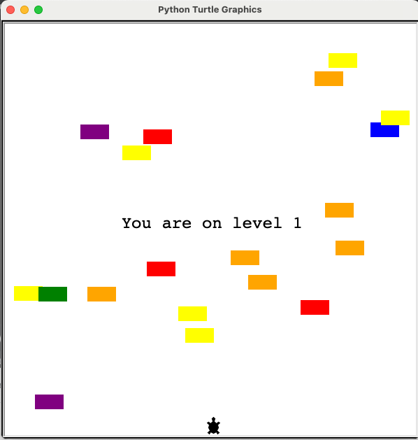
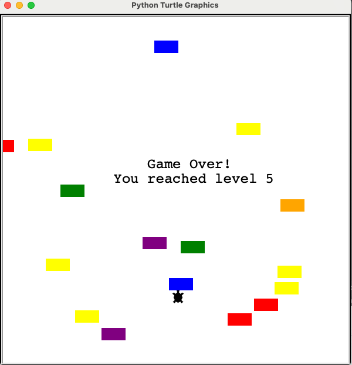

# Turtle Crossing Game in Python

I built this small game project in Python as part of the 100 Days of Code in Python course. This game allows users to play the Turtle Crossing Game and record their scores.

# Technologies

- [Python](https://www.python.org/)

# Minimum Viable Product

- A user can use the up arrow key to move a turtle forward and avoid being hit by cars to level up.
- Each time when a user crosses the finishing line successfully, the game levels up and the difficulty increases by speeding up the cars.
- A scoreboard will automatically record and update the user's score/level.
- A game over scsreen will be displayed once the turtle is hit by a car.

# Screenshots of The Application

- Ongoing game screen

- Game over screen

